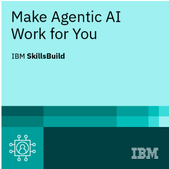
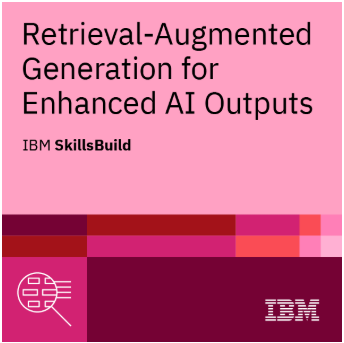
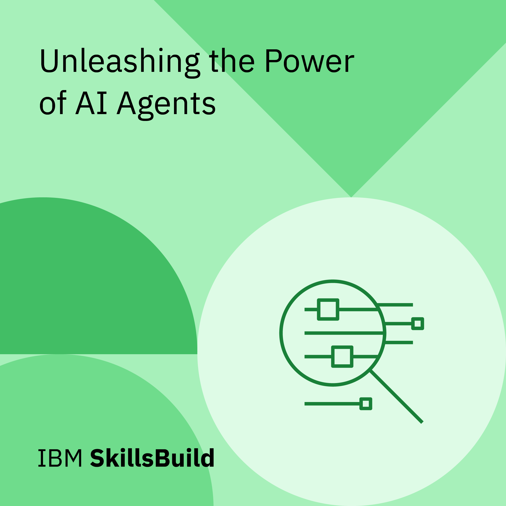
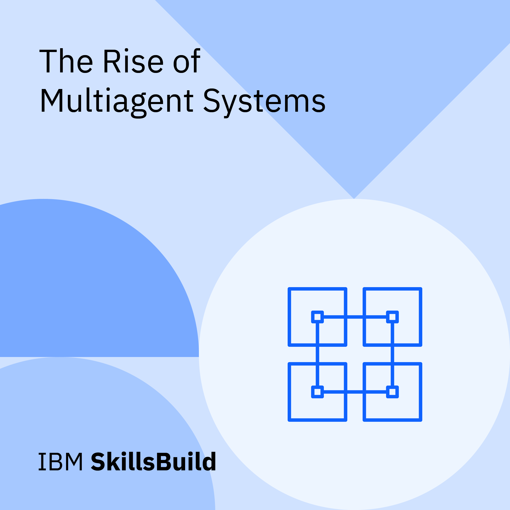

# IBM SkillsBuild: Applied AI Agents, Chatbots & RAG

## Course Overview

The **Applied AI Agents, Chatbots & RAG** learning program provided practical training in agentic artificial intelligence, chatbot development, prompt engineering, multiagent systems, and Retrieval-Augmented Generation.

The program combined foundational concepts with applied exercises involving AI agents, document-based knowledge retrieval, multimodal RAG, IBM Granite, and IBM watsonx.

## What I Learned

Through the combined course modules, I learned how to:

- Understand the core concepts of AI agents, chatbots, and Retrieval-Augmented Generation
- Identify practical use cases for agentic AI and RAG systems
- Categorize AI agents based on their characteristics and applications
- Explain how AI agents plan and perform tasks
- Distinguish between single-agent and multiagent systems
- Categorize multiagent systems according to how their agents interact
- Describe the benefits and use cases of multiagent systems across industries
- Explain how RAG expands the knowledge available to a large language model
- Describe the major stages of a RAG workflow
- Implement document-based RAG systems that enhance large language model responses
- Compare naive, advanced, and modular RAG implementation techniques
- Apply best practices for improving RAG system output quality
- Distinguish between text-only and multimodal RAG systems
- Describe the workflow and professional applications of multimodal RAG
- Apply analytical thinking and problem-solving skills to AI implementation challenges

## Cybersecurity Relevance

This training supports my cybersecurity career development by strengthening my understanding of how AI-enabled systems can assist with:

- Security operations and workflow automation
- Threat-intelligence research
- Security alert enrichment
- Incident-response support
- Retrieval of information from security policies, playbooks, and technical documentation
- Cybersecurity chatbot and virtual-assistant development
- Analysis of text, images, and other data through multimodal AI systems
- Responsible handling of private or sensitive data in AI workflows
- Identification of risks involving prompt injection, data leakage, inaccurate retrieval, bias, and unreliable AI output
- Human oversight and validation of AI-supported security decisions

---

# Verified Digital Credentials

The credentials below were issued by **IBM SkillsBuild** through **Credly**. Each credential includes an independently verifiable credential record.

## Make Agentic AI Work for You

  

**Issuing organization:** IBM SkillsBuild  
**Credential platform:** Credly  
**Date issued:** July 2, 2026  
**Expiration:** This credential does not expire  
**Credential ID:** `f883b8b1-9582-4727-ad94-10e124252e2a`  
**Verification:** [View credential on Credly](https://www.credly.com/earner/earned/badge/f883b8b1-9582-4727-ad94-10e124252e2a)

### Credential Description

This credential demonstrates an understanding of core concepts involving AI agents, Retrieval-Augmented Generation, and multiagent systems, with an emphasis on their application in real-world environments.

The training included simulation-based use cases involving the enhancement of human-resources virtual assistants with RAG and the automation of procurement processes.

### Skills Demonstrated

- AI agents
- AI prompting techniques
- Analytical thinking
- Generative AI
- IBM Granite
- IBM watsonx
- Problem solving
- Retrieval-Augmented Generation
- Multiagent systems
- Professional AI workflow automation

### Personal Reflection

This credential strengthened my understanding of how AI agents can perform goal-oriented tasks, interact with tools and knowledge sources, and support professional workflows.

The simulation-based exercises helped me see how agentic AI and RAG can improve virtual assistants and automate structured business processes. From a cybersecurity perspective, this training also reinforced the importance of access controls, trustworthy data sources, human oversight, and validation when AI agents are allowed to perform actions or retrieve organizational information.

---

## Retrieval-Augmented Generation for Enhanced AI Outputs

  

**Issuing organization:** IBM SkillsBuild  
**Credential platform:** Credly  
**Date issued:** July 15, 2026  
**Expiration:** This credential does not expire  
**Credential ID:** `9a6e3224-e064-4079-b140-741ecc080370`  
**Verification:** [View credential on Credly](https://www.credly.com/earner/earned/badge/9a6e3224-e064-4079-b140-741ecc080370)

### Credential Description

This credential demonstrates practical skills in implementing a document-based RAG system that enhances large language model responses and incorporates dynamic knowledge sources.

The training covered RAG workflows for content generation, techniques for improving output quality, differences between naive, advanced, and modular RAG implementations, and best practices for addressing common RAG system challenges.

### Skills Demonstrated

- Analytical thinking
- Generative AI
- Problem solving
- Retrieval-Augmented Generation
- RAG workflows
- RAG best practices
- RAG implementation techniques
- RAG evaluation metrics
- Text generation
- Dynamic knowledge integration
- Document-based retrieval

### Personal Reflection

This credential gave me a practical understanding of how external documents and knowledge sources can be connected to a large language model to produce more relevant and grounded responses.

I learned that a successful RAG implementation requires more than simply retrieving documents. The quality of the source material, retrieval process, prompt construction, context selection, evaluation method, and validation controls all affect the final result.

These concepts are especially relevant to cybersecurity knowledge systems that retrieve information from security policies, incident-response procedures, vulnerability documentation, and threat-intelligence sources.

---

# IBM SkillsBuild Digital Learning Stickers

The following digital stickers recognize the completion of individual learning modules within the course. These stickers document my learning progression but are not presented as independently verified Credly credentials.

## Unleashing the Power of AI Agents

  

**Type:** IBM SkillsBuild digital learning sticker  
**Date completed:** June 27, 2026  
**Course:** Applied AI Agents, Chatbots & RAG

### What I Learned

- Identified key use cases for AI agents
- Categorized AI agents based on their characteristics and applications
- Described how AI agents perform tasks

### Learning Reflection

This module introduced the foundational concepts behind AI agents and helped me understand how they differ according to their purpose, level of autonomy, environment, and application.

I learned how AI agents can receive goals, process information, make decisions, and perform tasks as part of a larger workflow. These capabilities have potential applications in cybersecurity automation, alert enrichment, knowledge retrieval, and analyst support.

---

## Introduction to Retrieval-Augmented Generation

  

**Type:** IBM SkillsBuild digital learning sticker  
**Date completed:** June 29, 2026  
**Course:** Applied AI Agents, Chatbots & RAG

### What I Learned

- Identified key use cases for Retrieval-Augmented Generation
- Explained how RAG expands the knowledge available to a large language model
- Described the key steps in a RAG workflow

### Learning Reflection

This module helped me understand how RAG systems retrieve information from external knowledge sources and provide that information to a large language model before the model generates a response.

I learned how this approach can improve relevance, reduce dependence on the model's internal training data, and support responses grounded in current or organization-specific information. In cybersecurity, a RAG system could retrieve information from security policies, threat reports, incident-response playbooks, or technical documentation.

---

## The Rise of Multiagent Systems

  

**Type:** IBM SkillsBuild digital learning sticker  
**Date completed:** July 2, 2026  
**Course:** Applied AI Agents, Chatbots & RAG

### What I Learned

- Distinguished between multiagent and single-agent systems
- Categorized multiagent systems based on how individual agents interact
- Identified the benefits and use cases of multiagent systems across industries

### Learning Reflection

This module introduced systems in which multiple AI agents communicate, coordinate, cooperate, or divide responsibilities to accomplish a larger objective.

I learned how multiagent systems can address complex problems by assigning specialized roles to different agents. A cybersecurity example could include separate agents for log analysis, threat-intelligence retrieval, vulnerability research, and incident documentation, with a human analyst reviewing the combined results.

---

## AI's New Superpower: Multimodal Retrieval-Augmented Generation

  

**Type:** IBM SkillsBuild digital learning sticker  
**Date completed:** July 6, 2026  
**Course:** Applied AI Agents, Chatbots & RAG

### What I Learned

- Distinguished between multimodal and text-only RAG systems
- Described the steps in a multimodal RAG workflow
- Identified practical use cases for multimodal RAG

### Learning Reflection

This module expanded my understanding of RAG beyond text-based documents. I learned how multimodal RAG systems can retrieve and process information from multiple formats, including text, images, diagrams, and other media.

In cybersecurity, multimodal retrieval could support the analysis of network diagrams, screenshots, security dashboards, technical documents, and visual evidence. The module also reinforced the importance of protecting sensitive data and verifying AI-generated interpretations.

---

# Tools and Technologies

Technologies and concepts covered during this learning program included:

- IBM SkillsBuild
- IBM Granite
- IBM watsonx
- Generative AI
- Large language models
- AI agents
- Multiagent systems
- Prompt engineering
- Retrieval-Augmented Generation
- Document-based retrieval
- Multimodal RAG
- Dynamic knowledge sources
- AI workflow design
- Responsible AI practices

# Portfolio Development Goals

I plan to apply the skills from this course through practical portfolio projects involving:

- A cybersecurity knowledge assistant using RAG
- An AI-assisted phishing-analysis workflow
- Retrieval from security policies and incident-response playbooks
- A prompt-injection and RAG security assessment
- An AI agent workflow for security-alert enrichment
- Evaluation of AI-generated cybersecurity responses for accuracy, grounding, and safety

---

*This learning record is part of my ongoing transition into cybersecurity and my preparation for analyst-focused roles involving security operations, threat analysis, vulnerability management, and emerging technology.*
