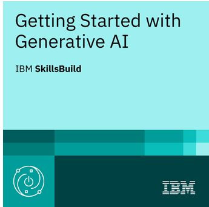
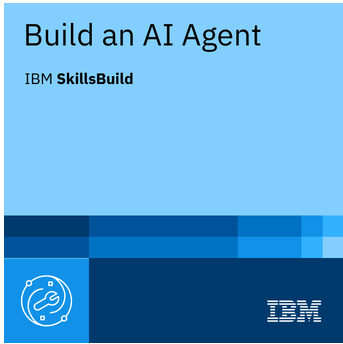
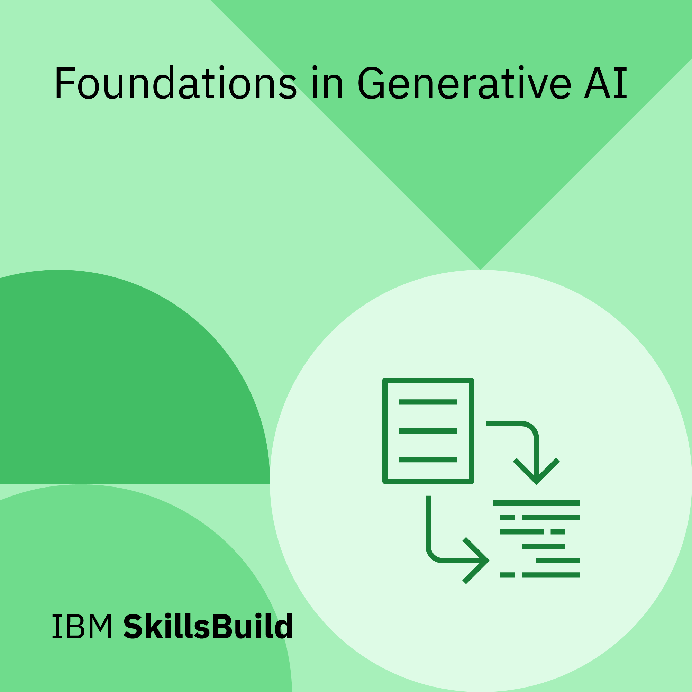
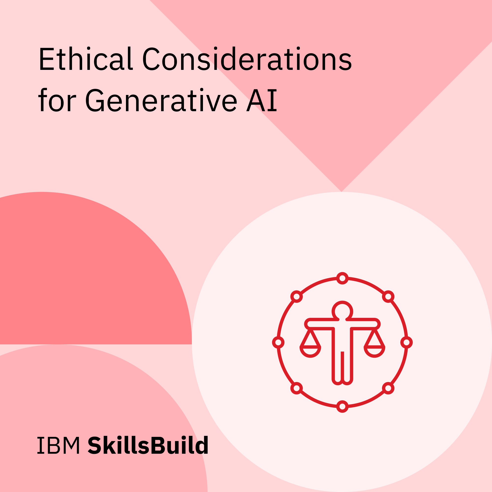
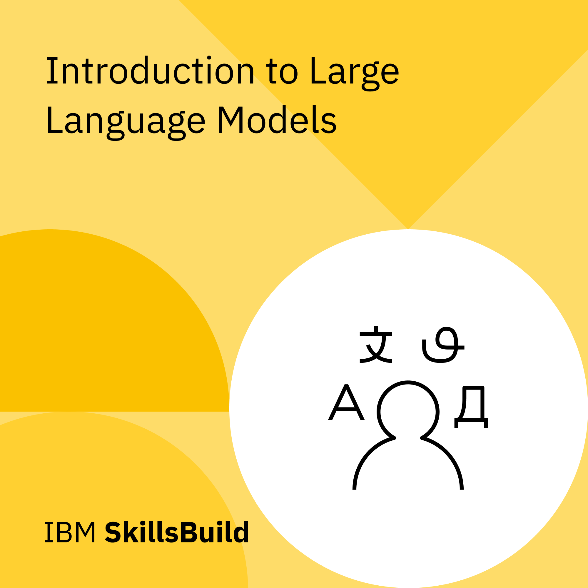

# IBM SkillsBuild: Generative AI and AI Agent

## Course Overview

The **Generative AI and AI Agent** learning program provided foundational and practical training in generative artificial intelligence, large language models, prompt engineering, responsible AI, and AI-agent development.

The program explored how generative AI systems produce content, how large language models respond to prompts, and how effective prompt-engineering techniques can improve AI-generated outputs. It also covered the ethical risks associated with generative AI and the process of designing, evaluating, deploying, and maintaining AI agents using IBM watsonx.ai.

## What I Learned

Through the combined course modules, I learned how to:

- Describe the major steps in the generative AI process
- Explain how large language models generate text from input prompts
- Identify tasks that generative AI is best suited to perform
- Apply prompt-refinement techniques to improve AI-generated responses
- Recognize the ethical importance of transparency, accountability, and fairness
- Identify risks associated with the data used by generative AI systems
- Explain ethical considerations involving AI-generated content
- Identify practical use cases for large language models
- Categorize the capabilities and functions of IBM Granite models
- Apply effective prompting techniques to guide large language models
- Select prompt types and prompt-engineering techniques for specific outcomes
- Build and optimize an AI agent using IBM watsonx.ai
- Classify AI agents according to their decision-making approaches
- Structure an AI-agent workflow
- Select appropriate evaluation metrics for AI-agent performance
- Identify important considerations for deploying and maintaining AI agents
- Use the IBM AI Risk Atlas to research AI risks and potential safeguards

## Cybersecurity Relevance

This training supports my cybersecurity career development by strengthening my understanding of how generative AI and AI agents can be used responsibly within technical and security-focused environments.

Potential cybersecurity applications include:

- Security operations workflow automation
- Threat-intelligence research and summarization
- Security-alert enrichment
- Incident-response documentation
- Phishing-message analysis
- Vulnerability research
- Policy and procedure retrieval
- Security-awareness content development
- AI-assisted knowledge management
- Analyst decision support

The training also reinforced the importance of recognizing risks involving:

- Sensitive-data exposure
- Prompt injection
- Inaccurate or fabricated AI output
- Biased data and model behavior
- Improper access to tools or organizational information
- Weak human oversight
- Inadequate evaluation and monitoring
- Unclear accountability for AI-assisted decisions

---

# Verified Digital Credentials

The credentials below were issued by **IBM SkillsBuild** through **Credly**. Each credential includes an independently verifiable credential record.

## Getting Started with Generative AI

**Issuing organization:** IBM SkillsBuild  
**Credential platform:** Credly  
**Date issued:** July 7, 2026  
**Expiration:** This credential does not expire  
**Credential ID:** `6637cf5c-456e-4e84-8413-4c7dfc461c40`  
**IBM learning activity ID:** `PWID-B1036800`  
**Verification:** [View credential on Credly](https://www.credly.com/earner/earned/badge/6637cf5c-456e-4e84-8413-4c7dfc461c40)

### Credential Description

This credential demonstrates an understanding of foundational generative AI concepts and the ethical considerations associated with using generative AI systems.

The training included locating information about AI risks and potential remedies through the IBM AI Risk Atlas. It also covered the practical use of large language models in scenarios such as customer service and content creation, with an emphasis on effectively guiding IBM Granite models.

### Skills Demonstrated

- AI ethics
- AI prompting techniques
- Analytical thinking
- Generative AI
- IBM AI Risk Atlas
- IBM Granite
- Large language models
- AI risk management
- Problem solving
- Responsible AI use

### Personal Reflection

This credential strengthened my understanding of how generative AI systems produce outputs and how the quality of those outputs depends on the instructions, context, and data provided to the model.

I also learned that responsible generative AI use requires more than technical proficiency. Privacy, security, fairness, transparency, accountability, and risk management must be considered throughout the AI lifecycle.

The IBM AI Risk Atlas introduced a structured way to research AI risks and possible safeguards. This is especially relevant to cybersecurity because AI systems may process sensitive information, generate inaccurate conclusions, or introduce new risks when they are connected to organizational data and workflows.

---

## Building an AI Agent

**Issuing organization:** IBM SkillsBuild  
**Credential platform:** Credly  
**Date issued:** July 17, 2026  
**Expiration:** This credential does not expire  
**Credential ID:** `2dd90fc2-7388-4e72-a578-ba3e3efc812c`  
**IBM learning activity ID:** `PWID-B1021600`  
**Verification:** [View credential on Credly](https://www.credly.com/earner/earned/badge/2dd90fc2-7388-4e72-a578-ba3e3efc812c)

### Credential Description

This credential demonstrates the technical knowledge and practical skills required to build and optimize an AI agent using IBM watsonx.ai.

The training covered the classification of AI agents according to their decision-making approaches, the steps involved in structuring an AI-agent workflow, the selection of appropriate evaluation metrics, and the major considerations involved in deploying and maintaining AI agents.

### Skills Demonstrated

- AI-agent development
- Agentic AI
- AI-agent workflows
- Agent deployment lifecycle
- AI ethics
- Artificial intelligence applications
- Critical thinking
- Evaluation metrics
- Generative AI
- IBM watsonx.ai
- Problem solving
- AI-agent optimization

### Personal Reflection

This credential gave me practical insight into how AI agents are designed, structured, evaluated, and prepared for deployment.

I learned that building an AI agent involves more than connecting a language model to a task. The agent requires a clearly defined objective, an organized workflow, appropriate tools and data, performance measurements, and controls for monitoring its behavior.

From a cybersecurity perspective, AI agents must also be designed with appropriate permissions, data protections, logging, validation, and human oversight. An agent that can retrieve information or perform actions may create security risks when its access is broader than necessary or its output is accepted without review.

---

# IBM SkillsBuild Digital Learning Stickers

The following digital stickers recognize the completion of individual learning modules within this course. They document my learning progression but are not presented as independently verified Credly credentials.

## Foundations in Generative AI

  

**Type:** IBM SkillsBuild digital learning sticker  
**Date completed:** July 1, 2026  
**Course:** Generative AI and AI Agent

### What I Learned

- Described the steps in the generative AI process
- Identified how large language models generate text based on input prompts
- Selected tasks that generative AI is best suited to perform
- Applied prompt-refinement techniques to improve AI-generated responses

### Learning Reflection

This module introduced the process through which generative AI systems receive input, interpret instructions, and produce new content.

I learned that large language models generate responses by analyzing patterns and relationships within language rather than by reasoning or understanding information in the same way a person does. This distinction reinforces the importance of reviewing AI-generated output for accuracy, relevance, and potential errors.

I also practiced improving results by refining prompts, adding context, clarifying expectations, and defining the desired output format.

---

## Ethical Considerations for Generative AI

  

**Type:** IBM SkillsBuild digital learning sticker  
**Date completed:** July 2, 2026  
**Course:** Generative AI and AI Agent

### What I Learned

- Described the ethical pillars of transparency, accountability, and fairness
- Identified ethical considerations and risks involving data inputs
- Explained the ethical implications of managing AI-generated content

### Learning Reflection

This module reinforced the importance of using generative AI in a transparent, accountable, and fair manner.

I learned that AI risks can originate from the data provided to a system, the way a model is trained or configured, and the manner in which generated content is used. Sensitive data, biased information, incomplete context, and unclear ownership can all create ethical and security concerns.

These principles are directly relevant to cybersecurity because AI systems may process confidential information or influence decisions that affect users, employees, and organizations.

---

## Introduction to Large Language Models

  

**Type:** IBM SkillsBuild digital learning sticker  
**Date completed:** July 7, 2026  
**Course:** Generative AI and AI Agent

### What I Learned

- Identified key use cases for large language models
- Categorized the functions of IBM Granite models
- Described effective prompting techniques for guiding LLMs in targeted tasks

### Learning Reflection

This module helped me understand the range of tasks large language models can support, including summarization, classification, question answering, content development, and information extraction.

I also learned about the functions of IBM Granite models and how prompts can be structured to guide a model toward a specific task or outcome.

For cybersecurity applications, large language models may support analysts by summarizing technical information, organizing findings, explaining security concepts, and assisting with documentation. Their outputs must still be validated against reliable sources.

---

## Prompt Engineering: Shaping Better AI Responses

  

**Type:** IBM SkillsBuild digital learning sticker  
**Date completed:** July 7, 2026  
**Course:** Generative AI and AI Agent

### What I Learned

- Identified the applications of different prompt types used in generative AI
- Selected prompt-engineering techniques appropriate for the desired output
- Recognized best practices for writing effective prompts

### Learning Reflection

This module demonstrated how prompt structure affects the relevance, clarity, and usefulness of AI-generated responses.

I learned to improve prompts by defining the task, supplying relevant context, specifying constraints, assigning an appropriate role, providing examples when needed, and describing the desired output format.

Effective prompt engineering can improve cybersecurity workflows involving report summaries, security-awareness material, incident documentation, and structured analysis. However, prompt quality does not eliminate the need to verify the model's output.

---

# Tools and Technologies

Technologies and concepts covered during this learning program included:

- IBM SkillsBuild
- IBM Granite
- IBM watsonx.ai
- IBM AI Risk Atlas
- Generative AI
- Large language models
- AI agents
- Agentic AI
- Prompt engineering
- Prompt refinement
- AI-agent workflows
- Evaluation metrics
- Agent deployment lifecycle
- Responsible AI
- AI ethics
- AI risk management
- Human oversight

# Portfolio Development Goals

I plan to apply the skills from this course through practical portfolio projects involving:

- A security-focused AI agent prototype
- An AI-assisted phishing-message analysis workflow
- A prompt-engineering library for cybersecurity tasks
- An assessment of AI risks using the IBM AI Risk Atlas
- A comparison of prompt techniques for security-report summarization
- An AI-agent security and access-control checklist
- Evaluation criteria for accuracy, safety, and reliability
- Documentation of responsible AI practices for cybersecurity teams

---

*This learning record is part of my continuing transition into cybersecurity and my preparation for analyst-focused roles involving security operations, threat analysis, vulnerability management, automation, and emerging technology.*
